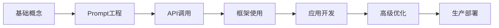

# AI大模型概述

## 什么是大语言模型（LLM）

大语言模型（Large Language Model，简称 LLM）是基于深度学习技术训练的自然语言处理模型，能够理解、生成和处理人类语言。它们通过在海量文本数据上进行预训练，学习语言的统计规律和语义关系，从而具备强大的语言理解和生成能力。

### 核心特征

- **规模巨大**：参数量从数十亿到数万亿不等
- **通用性强**：可应用于多种任务和场景
- **涌现能力**：在达到一定规模后展现出意想不到的能力
- **零样本学习**：无需特定训练即可执行新任务

## 发展历程与关键技术突破

### 早期阶段（2017-2018）

**Transformer 架构的诞生**

2017年，Google 发表了划时代的论文《Attention Is All You Need》，提出了 Transformer 架构。这一架构摒弃了传统的循环神经网络（RNN），完全基于自注意力机制（Self-Attention），大幅提升了训练效率和模型性能。

```python
# Transformer 核心：自注意力机制简化示例
import torch
import torch.nn as nn

class SelfAttention(nn.Module):
    def __init__(self, embed_size, heads):
        super(SelfAttention, self).__init__()
        self.embed_size = embed_size
        self.heads = heads
        self.head_dim = embed_size // heads
        
        assert (self.head_dim * heads == embed_size), "Embed size needs to be divisible by heads"
        
        self.values = nn.Linear(self.head_dim, self.head_dim, bias=False)
        self.keys = nn.Linear(self.head_dim, self.head_dim, bias=False)
        self.queries = nn.Linear(self.head_dim, self.head_dim, bias=False)
        self.fc_out = nn.Linear(heads * self.head_dim, embed_size)
    
    def forward(self, values, keys, query, mask):
        # 实现自注意力计算
        pass
```

### GPT 时代（2018-2020）

**GPT-1（2018）**
- OpenAI 发布首个 Generative Pre-trained Transformer
- 1.17亿参数
- 证明了无监督预训练 + 有监督微调的有效性

**GPT-2（2019）**
- 15亿参数
- 展示了规模化带来的能力提升
- 能够生成连贯的文章

**GPT-3（2020）**
- 1750亿参数
- 引入 In-context Learning（上下文学习）
- 展现了强大的零样本学习能力

### 指令微调与对齐（2021-2022）

**InstructGPT / ChatGPT**
- 引入人类反馈强化学习（RLHF）
- 使模型更好地遵循人类指令
- 大幅提升对话质量和安全性

**关键技术：**
- Supervised Fine-Tuning (SFT)
- Reward Modeling
- Proximal Policy Optimization (PPO)

### 开源与多元化发展（2023至今）

**代表性模型：**
- LLaMA（Meta）：开启开源大模型时代
- Claude（Anthropic）：强调安全性和长上下文
- Gemini（Google）：原生多模态能力
- Qwen（阿里）、文心一言（百度）：中文能力突出

## 主流模型对比

| 模型 | 开发商 | 参数量 | 上下文长度 | 特点 |
|------|--------|--------|-----------|------|
| GPT-4 | OpenAI | 未公开 | 128K | 综合能力最强，生态完善 |
| GPT-3.5-turbo | OpenAI | 未公开 | 16K | 性价比高，应用广泛 |
| Claude 3 Opus | Anthropic | 未公开 | 200K | 长文本处理优秀 |
| Claude 3 Sonnet | Anthropic | 未公开 | 200K | 速度与能力平衡 |
| Llama 3 | Meta | 70B/8B | 8K | 开源，可本地部署 |
| Qwen 2 | 阿里云 | 72B/7B | 32K | 中文能力强 |
| Gemini Pro | Google | 未公开 | 32K | 多模态原生支持 |

### 选择建议

**根据使用场景选择：**

```
需要最强综合能力 → GPT-4 / Claude 3 Opus
追求性价比 → GPT-3.5-turbo / Claude 3 Sonnet
需要本地部署 → Llama 3 / Qwen 2
中文场景优先 → Qwen 2 / 文心一言
长文档处理 → Claude 3 (200K上下文)
多模态需求 → GPT-4 Vision / Gemini Pro
```

## 核心技术原理

### Transformer 架构

```
输入文本 → Tokenization → Embedding → Transformer Layers → Output
                                    ↓
                          ┌─────────────────┐
                          │ Multi-Head       │
                          │ Self-Attention   │
                          ├─────────────────┤
                          │ Feed Forward     │
                          │ Network          │
                          ├─────────────────┤
                          │ Layer Norm       │
                          └─────────────────┘
                          (重复 N 次)
```

### 关键概念

**Token（词元）**
- 文本的基本处理单位
- 可以是单词、子词或字符
- GPT-4 约 1 token ≈ 0.75 个英文单词

**Context Window（上下文窗口）**
- 模型一次能处理的 token 数量
- 包括输入 prompt 和输出 response
- 更大的窗口意味着能处理更长的文档

**Temperature（温度）**
- 控制输出的随机性
- 低温度（0.1-0.3）：更确定、保守
- 高温度（0.7-1.0）：更有创意、多样

## 应用场景

### 内容创作
- 文章写作、文案生成
- 代码生成与审查
- 翻译与润色

### 智能客服
- 自动问答系统
- 客户支持助手
- 知识库检索

### 数据分析
- 自然语言查询数据库
- 数据洞察生成
- 报告自动化

### 教育辅助
- 个性化 tutoring
- 作业批改
- 知识问答

### 开发提效
- 代码补全（GitHub Copilot）
- Bug 修复建议
- 文档生成

## 未来趋势

### 技术发展方向

1. **更大规模与更高效率**
   - 参数持续增加
   - 推理效率优化
   - 稀疏激活模型

2. **多模态融合**
   - 文本、图像、音频、视频统一处理
   - 跨模态理解与生成

3. **Agent 能力增强**
   - 自主规划与执行
   - 工具使用能力
   - 长期记忆

4. **专业化与垂直化**
   - 医疗、法律、金融等垂直领域
   - 行业专属模型

5. **安全与对齐**
   - 更好的价值观对齐
   - 减少幻觉（Hallucination）
   - 可解释性提升

### 挑战与思考

**技术挑战：**
- 计算资源需求巨大
- 训练数据质量与版权
- 模型幻觉问题
- 能耗与环境 impact

**社会影响：**
- 就业结构变化
- 信息真实性挑战
- 隐私与安全
- 数字鸿沟

## 学习路径建议



**推荐学习顺序：**
1. 理解大模型基本原理和能力边界
2. 掌握 Prompt Engineering 技巧
3. 学会调用主流 API
4. 使用 LangChain 等框架构建应用
5. 开发实际项目积累经验
6. 深入学习优化和部署技术

## 延伸阅读

- [OpenAI Cookbook](https://cookbook.openai.com/)
- [Hugging Face Course](https://huggingface.co/course)
- [LangChain Documentation](https://python.langchain.com/docs/)
- 《Attention Is All You Need》原始论文

## 小结

大语言模型正在深刻改变我们与计算机交互的方式，以及各行各业的工作流程。理解其基本原理、掌握使用技巧、了解能力边界，是进入 AI 时代的关键技能。本系列教程将从基础到进阶，帮助你系统地掌握大模型开发的全流程。

下一步，我们将深入学习 **Prompt 工程**，这是与大模型高效沟通的核心技能。
